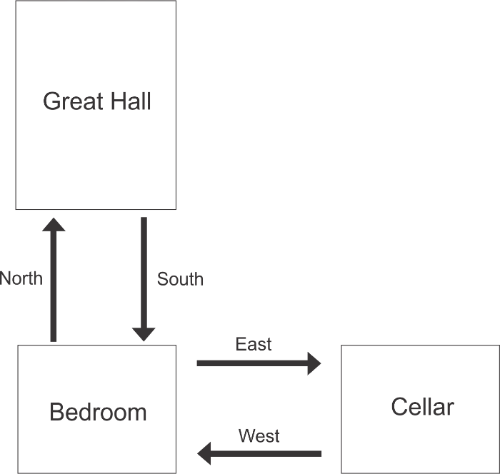

# Milestone Six Project One Requirements

## Prompt

For this milestone, you will be submitting a working draft of the code for a simplified version of the text-based game that you are developing for Project Two. You will focus on displaying how a room dictionary works with the “move” commands. This will include the if, else, and elif statements that move the adventurer from one room to another.

1. Before beginning this milestone, it is important to understand the required functionality for this simplified version of the game. The game should prompt the player to enter commands to either move between rooms or exit the game. Review the Milestone Simplified Dragon Text Game Video and the Milestone Simplified Text Game Flowchart to see an example of the simplified version of the game. A video transcript is available: Transcript for Milestone Simplified Dragon Text Game Video. 
    * IMPORTANT: The “Move Between Rooms” process in the Milestone Simplified Text Game Flowchart is intentionally vague. You designed a more detailed flowchart or pseudocode for this process as a part of your work on Project One. Think about how your design will fit into this larger flowchart.
1. In PyCharm, create a new code file titled “ModuleSixMilestone.py.” At the top of the file, include a comment with your name. As you develop your code, you must use industry standard best practices, including in-line comments and appropriate naming conventions, to enhance the readability and maintainability of the code.
1. Next, copy the following dictionary into your PY file. This dictionary links rooms to one another and will be used to store all possible moves per room, in order to properly validate player commands (input). This will allow the player to move only between rooms that are linked.
    * Note: For this milestone, you are being given a dictionary and map for a simplified version of the dragon-themed game. Make sure to read the code carefully so that you understand how it works. In Project Two, you will create your own dictionary based on your designs.
    ```python
    #A dictionary for the simplified dragon text game
    #The dictionary links a room to other rooms.
    rooms = {
            'Great Hall': {'South': 'Bedroom'},
            'Bedroom': {'North': 'Great Hall', 'East': 'Cellar'},
            'Cellar': {'West': 'Bedroom'}
        }
    ```
    
1. Next, you will develop code to meet the required functionality, by prompting the player to enter commands to move between the rooms or exit the game. To achieve this, you must develop the following:
    * A gameplay loop that includes:
        * Output that displays the room the player is currently in
        * Decision branching that tells the game how to handle the different commands. The commands can be to either move between rooms (such as go North, South, East, or West) or exit.
            * If the player enters a valid “move” command, the game should use the dictionary to move them into the new room.
            * If the player enters “exit,” the game should set their room to a room called “exit.”
            * If the player enters an invalid command, the game should output an error message to the player (input validation).
        * A way to end the gameplay loop once the player is in the “exit” room
    * TIP: Use the pseudocode or flowchart that you designed in Step #4 of Project One to help you develop your code.
1. As you develop, you should debug your code to minimize errors and enhance functionality. After you have developed all of your code, be sure to run the code to test and make sure it is working correctly.
    * What happens if the player enters a valid direction Does the game move them to the correct room?
    * What happens if the player enters an invalid direction? Does the game provide the correct output?
    * Can the player exit the game?
